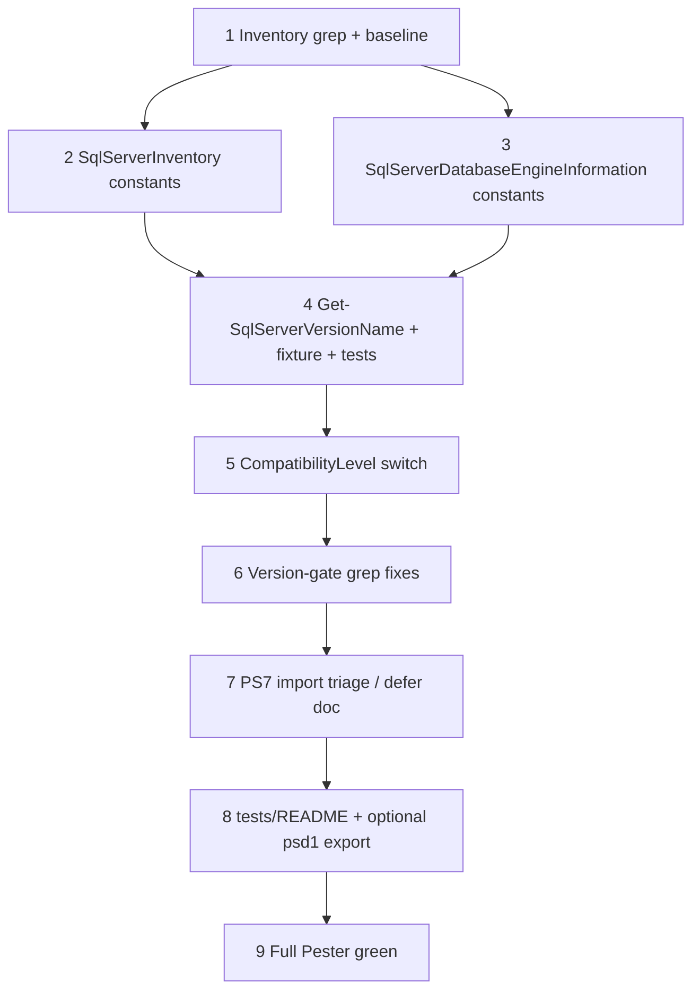

## Initial User Prompt

/add-task turn the current build plan into a series of tasks for the Spec driven design workflow

## Description

### Problem statement and goal

SQL Power Doc’s version constants and human-readable mappings stop at **SQL Server 2019** (major **15**). Inventory and engine-information code compares `System.Version` against those constants and maps SMO `CompatibilityLevel` only through **2012 (110)** in at least one hot path. As a result, **SQL Server 2022 (16.x)** and **SQL Server 2025 (17.x)** instances are mislabeled, treated as “unknown” in `Get-SqlServerVersionName`, or display raw compatibility enum text instead of friendly labels.

**Goal:** Add first-class support for **2022** and **2025** in shared version constants, `Get-SqlServerVersionName`, and compatibility-level display (where SMO exposes enum members), with **Pester coverage** aligned to the existing `tests/fixtures` pattern until the full module imports on PowerShell 7+.

### In scope

- Add **`SQLServer2022`** (`16.0.0.0`) and **`SQLServer2025`** (`17.0.0.0`) script-scope constants in:
  - `Modules/SqlServerDatabaseEngineInformation/SqlServerDatabaseEngineInformation.psm1` (after existing `SQLServer2019`).
  - `Modules/SqlServerInventory/SqlServerInventory.psm1` (mirror the same constant block).
- Extend **`Get-SqlServerVersionName`** in `SqlServerDatabaseEngineInformation.psm1` for `(16,0) → '2022'` and `(17,0) → '2025'` (minor **0** RTM path; document preview minors as out-of-scope unless they appear in the field).
- Extend the **`CompatibilityLevel` switch** (~line 8824) to map `Version120`–`Version170` **when present** on the loaded SMO type (use a pattern safe for older SMO: resolve enum static fields by name or guard with `try` / `$null` checks so Windows PowerShell 5.1 + older SSMS still load).
- **Grep-driven** updates: any logic that assumes **2019 is the newest** and should explicitly include 2022/2025 for correctness (e.g. upper-bound checks, “supported version” messaging). Do **not** blindly rewrite every `CompareTo($SQLServer2012)`—only branches where the business meaning is “supported modern versions.”
- **Tests:** Update `tests/fixtures/Get-SqlServerVersionName.ps1` and `tests/Get-SqlServerVersionName.test.ps1` with cases for 16/0 and 17/0.
- **Optional same-task:** Add `Get-SqlServerVersionName` to `FunctionsToExport` in `SqlServerDatabaseEngineInformation.psd1` **if** a minimal PS7 import fix lands in this task; otherwise document deferral in `tests/README.md`.

### Out of scope

- Replacing COM/Excel or ImportExcel migrations (separate tasks).
- Full `SqlServerDatabaseEngineInformation.psm1` refactor or splitting into Public/Private.
- NuGet/SMO package migration (document as follow-up if GAC SMO lacks `Version170`).
- Azure SQL Database-specific marketing strings beyond what SMO already returns.

### Risks and assumptions

| Risk | Mitigation |
|------|------------|
| SMO enum lacks `Version160`/`Version170` on contributor machine | Use defensive mapping; keep `default { $_.ToString() }`; document required SSMS/SMO version for full labels. |
| `SqlServerDatabaseEngineInformation.psm1` fails to import on PS 7+ | Track triage as explicit step; keep fixture-based tests green regardless. |
| Accidental behavior change in version gates | Prefer additive constants + targeted grep; run Pester + spot-check one inventory script path if available. |
| Duplicate `New-Variable` blocks in `SqlServerInventory.psm1` | When editing constants region, avoid introducing a third duplicate; consolidate only if trivial. |

**Assumption:** SQL Server **2025** uses **major 17**, **minor 0** at RTM (verify against [Microsoft Learn](https://learn.microsoft.com/sql/) / release notes during implementation).

## Research notes (Phase 2a)

- SQL Server version/build mapping: [SQL Server versions](https://learn.microsoft.com/sql/sql-server/sql-server-version-support) and community build lists (verify 16.x / 17.x).
- Pester 5: existing harness `tests/Run-AllTests.ps1`; extend `*.test.ps1` only.
- SMO `CompatibilityLevel` enum members vary by assembly version—use reflection-safe patterns in PowerShell.

**Skill / analysis reference:** See [.specs/analysis/analysis-implement-sql-version-map-sql2025.md](../../../.specs/analysis/analysis-implement-sql-version-map-sql2025.md).

## Codebase analysis (Phase 2b)

- **Constants:** `SQLServer2000` … `SQLServer2019` in `SqlServerDatabaseEngineInformation.psm1` (lines ~17–26) and `SqlServerInventory.psm1` (~38–46).
- **`Get-SqlServerVersionName`:** ~3944 in `SqlServerDatabaseEngineInformation.psm1`; not exported in `.psd1` today (`FunctionsToExport` = `Get-SqlServerDatabaseEngineInformation` only).
- **Compatibility display:** Switch at ~8824 stops at `Version110`; `default` uses `$_.ToString()`.
- **Tests:** Fixture mirrors psm1 at `tests/fixtures/Get-SqlServerVersionName.ps1`; tests in `tests/Get-SqlServerVersionName.test.ps1`.

## Business analysis (Phase 2c)

This feature is **foundational** for accurate documentation output and correct version-gated logic on modern instances. Acceptance criteria below are **test-first** where possible (fixture + Pester) so CI does not require a live SQL Server.

## Acceptance criteria

1. **Given** `SqlServerDatabaseEngineInformation.psm1` and `SqlServerInventory.psm1`, **when** constants are inspected, **then** `SQLServer2022` and `SQLServer2025` exist as `System.Version` **16.0.0.0** and **17.0.0.0** respectively.
2. **Given** `Get-SqlServerVersionName -MajorVersion 16 -MinorVersion 0`, **when** invoked (via fixture or live module), **then** output is **`2022`**.
3. **Given** `Get-SqlServerVersionName -MajorVersion 17 -MinorVersion 0`, **when** invoked, **then** output is **`2025`**.
4. **Given** SMO exposes `CompatibilityLevel.Version120` (or higher) on the developer’s assembly, **when** database options are serialized in the path using the switch at ~8824, **then** human-readable labels include **2014 (120)** through **2025 (170)** as applicable (fallback to `default` when enum member missing).
5. **Given** `pwsh -File .\tests\Run-AllTests.ps1`, **when** run from repo root, **then** exit code **0** and new version cases pass.
6. **Given** a contributor on **older SMO**, **when** they import the module on Windows PowerShell 5.1, **then** no new parse/runtime failure is introduced by compatibility mapping guards.

## Architecture Overview

### Solution strategy

1. **Add version constants** in both large modules in the existing style (`New-Object System.Version` + `New-Variable -Option Constant`).
2. **Extend `Get-SqlServerVersionName`** with explicit `elseif` branches for 16/0 and 17/0; mirror in **`tests/fixtures`** the same day (single commit or immediate follow-up commit).
3. **CompatibilityLevel:** Extend the existing `switch` with cases for `Version120` … `Version170` using **static member access** on `$CompatibilityLevel` only if non-null; optional helper `Get-CompatibilityLevelLabel` if duplication appears—otherwise keep inline for minimal churn.
4. **Targeted grep** for `SQLServer2019`, `15.0.0.0`, and “2019” in version-sensitive strings; update only where 2022/2025 must be recognized as newer or displayed correctly.

### Key decisions

| Decision | Rationale |
|----------|-----------|
| Mirror constants in **two** psm1 files | Matches current duplication pattern; avoids single-file refactor scope creep. |
| Fixture stays authoritative for PS7 CI until module loads | Matches bootstrap precedent. |
| Defensive SMO enum cases | Older SSMS must not break module load. |

### Components

| Path | Action |
|------|--------|
| `Modules/SqlServerDatabaseEngineInformation/SqlServerDatabaseEngineInformation.psm1` | Modify — constants, `Get-SqlServerVersionName`, compatibility switch, selective compares |
| `Modules/SqlServerInventory/SqlServerInventory.psm1` | Modify — constants (+ targeted compares if grep shows need) |
| `tests/fixtures/Get-SqlServerVersionName.ps1` | Modify — sync with psm1 |
| `tests/Get-SqlServerVersionName.test.ps1` | Modify — new cases |
| `tests/README.md` | Modify — note 2022/2025 fixture sync + SMO version caveat |
| `Modules/SqlServerDatabaseEngineInformation/SqlServerDatabaseEngineInformation.psd1` | Optional — export `Get-SqlServerVersionName` if import fixed |

## Parallel Execution Plan

**MUST** run **Step 2** (constants in `SqlServerInventory`) and **Step 3** (constants in `SqlServerDatabaseEngineInformation`) in parallel after **Step 1** completes, then merge before **Step 4** (single writer for `Get-SqlServerVersionName` + fixture).

**Critical path:** 1 → (2 ∥ 3) → 4 → 5 → 6 → 7 → 8 → 9

| Step | Suggested agent |
|------|-----------------|
| 1, 6, 7 | `explore` / `code-explorer` |
| 2, 3, 4, 5 | `developer` |
| 8 | `tech-writer` |
| 9 | `testing-reviewer` + `developer` |

**Sub-agent execution directive:** For parallel steps 2 and 3, agents MUST NOT edit the same file; merge conflicts resolved in Step 4 owner session.

## Implementation Process

### Step 1: Baseline grep and version-sensitive inventory

**Dependencies:** `bootstrap-dev-branch-pester-module-skeleton.chore.md` complete  
**Success criteria:**

- [ ] Document grep patterns used: `SQLServer2019`, `15.0.0.0`, `Get-SqlServerVersionName`, `CompatibilityLevel`.
- [ ] List candidate line regions for Step 6 (file + short reason).

**Expected output:** Notes in scratchpad or PR description (optional `.specs/scratchpad/*.md`).

#### Verification

**Level:** None

---

### Step 2: Add `SQLServer2022` / `SQLServer2025` constants — SqlServerInventory

**Dependencies:** 1  
**Parallel with:** Step 3  
**Success criteria:**

- [ ] Constants appended after `SQLServer2019` using same pattern as existing lines.
- [ ] No accidental duplicate `New-Variable` for the same name.

**Expected output:** Modified `Modules/SqlServerInventory/SqlServerInventory.psm1`

#### Verification

**Level:** Single Judge  
**Artifact:** `Modules/SqlServerInventory/SqlServerInventory.psm1` (constant block only)  
**Threshold:** 4.0/5.0  

**Rubric:**

| Criterion | Weight | Description |
|-----------|--------|-------------|
| Version accuracy | 0.40 | 16.0.0.0 and 17.0.0.0 for 2022/2025 RTM. |
| Pattern consistency | 0.30 | Matches existing `New-Object` / `New-Variable` style. |
| Safety | 0.20 | No syntax errors; no duplicate names. |
| Scope | 0.10 | Constants only—no unrelated edits. |

---

### Step 3: Add `SQLServer2022` / `SQLServer2025` constants — SqlServerDatabaseEngineInformation

**Dependencies:** 1  
**Parallel with:** Step 2  
**Success criteria:**

- [ ] Same as Step 2 for `Modules/SqlServerDatabaseEngineInformation/SqlServerDatabaseEngineInformation.psm1`.

**Expected output:** Modified `SqlServerDatabaseEngineInformation.psm1` (constant section)

#### Verification

**Level:** Single Judge  
**Artifact:** `SqlServerDatabaseEngineInformation.psm1` (constant block)  
**Threshold:** 4.0/5.0  

**Rubric:** (same weights as Step 2)

---

### Step 4: Extend `Get-SqlServerVersionName` + fixture + Pester

**Dependencies:** 2, 3  
**Success criteria:**

- [ ] `Get-SqlServerVersionName` returns `2022` / `2025` for 16,0 / 17,0.
- [ ] `tests/fixtures/Get-SqlServerVersionName.ps1` matches psm1 logic.
- [ ] `tests/Get-SqlServerVersionName.test.ps1` asserts both cases + preserves unknown behavior.

**Expected output:** Three files as listed.

#### Verification

**Level:** Panel of 2 Judges with aggregated voting  
**Artifacts:** `SqlServerDatabaseEngineInformation.psm1` (function only), `tests/fixtures/Get-SqlServerVersionName.ps1`, `tests/Get-SqlServerVersionName.test.ps1`  
**Threshold:** 4.5/5.0  

**Rubric:**

| Criterion | Weight | Description |
|-----------|--------|-------------|
| Mapping correctness | 0.35 | 16/0 and 17/0 correct; legacy rows unchanged. |
| Fixture parity | 0.25 | Fixture and psm1 stay identical in branching. |
| Test quality | 0.25 | Pester 5 idioms; deterministic. |
| Regression | 0.15 | Existing 2012 / unknown tests still pass. |

---

### Step 5: Extend `CompatibilityLevel` display switch

**Dependencies:** 4  
**Success criteria:**

- [ ] Version120 → SQL Server 2014 (120); 130 → 2016; 140 → 2017; 150 → 2019; 160 → 2022; 170 → 2025 (labels match project style).
- [ ] Guards for missing enum members; no throw on older SMO.

**Expected output:** Modified `SqlServerDatabaseEngineInformation.psm1` (~8824 region)

#### Verification

**Level:** Single Judge  
**Artifact:** `SqlServerDatabaseEngineInformation.psm1` (switch block)  
**Threshold:** 4.5/5.0  

**Rubric:**

| Criterion | Weight | Description |
|-----------|--------|-------------|
| Label accuracy | 0.35 | Numbers 120–170 map to correct marketing names. |
| Backward compatibility | 0.35 | Old SMO loads; unknown enums fall through gracefully. |
| Consistency | 0.20 | Matches existing string style in switch. |
| Scope | 0.10 | No unrelated refactors. |

---

### Step 6: Targeted version-gate and string updates

**Dependencies:** 5  
**Success criteria:**

- [ ] Each change tied to a grep hit from Step 1 with explicit rationale in commit message or task notes.
- [ ] No change to unrelated legacy Windows / Azure strings.

**Expected output:** Additional edits in one or both psm1 files

#### Verification

**Level:** Single Judge  
**Threshold:** 4.0/5.0  

**Rubric:**

| Criterion | Weight | Description |
|-----------|--------|-------------|
| Necessity | 0.40 | Only gates that need 2022/2025 awareness. |
| Correctness | 0.35 | CompareTo / messaging logic still valid. |
| Minimality | 0.25 | Smallest diff per site. |

---

### Step 7: PowerShell 7+ module import triage (fix or defer)

**Dependencies:** 6  
**Success criteria:**

- [ ] Record root cause of `Import-Module` failure on PS 7+ (parser vs runtime).
- [ ] Either minimal fix enabling import **or** explicit defer with link to follow-up task and `tests/README.md` update.

**Expected output:** Doc note + optional code fix

#### Verification

**Level:** Single Judge  
**Threshold:** 4.0/5.0  

**Rubric:**

| Criterion | Weight | Description |
|-----------|--------|-------------|
| Root cause clarity | 0.45 | Actionable description. |
| Decision | 0.35 | Fix vs defer explicit. |
| Test impact | 0.20 | Pester still green. |

---

### Step 8: Documentation and optional manifest export

**Dependencies:** 7  
**Success criteria:**

- [ ] `tests/README.md`: fixture sync rule for 2022/2025; SMO version note for compatibility labels.
- [ ] If Step 7 fixed import: add `Get-SqlServerVersionName` to `FunctionsToExport` and add import-based test **or** keep fixture with explanation.

**Expected output:** `tests/README.md`, optionally `SqlServerDatabaseEngineInformation.psd1`

#### Verification

**Level:** Single Judge  
**Artifacts:** `tests/README.md`  
**Threshold:** 4.0/5.0  

**Rubric:**

| Criterion | Weight | Description |
|-----------|--------|-------------|
| Contributor clarity | 0.40 | Explains fixture vs live module. |
| Accuracy | 0.35 | Matches implemented behavior. |
| Brevity | 0.25 | No duplicate of README root. |

---

### Step 9: Verification — full test suite

**Dependencies:** 8  
**Success criteria:**

- [ ] `pwsh -File .\tests\Run-AllTests.ps1` exit 0 from repo root on implementation machine.

**Expected output:** Green Pester run (log in CI or local)

#### Verification

**Level:** None (binary gate)

---

## Verification Summary

| Step | Level | Threshold | Artifacts |
|------|-------|-----------|-----------|
| 1 | None | — | Notes |
| 2 | Single Judge | 4.0/5.0 | `SqlServerInventory.psm1` |
| 3 | Single Judge | 4.0/5.0 | `SqlServerDatabaseEngineInformation.psm1` |
| 4 | Panel ×2 | 4.5/5.0 | psm1 + fixture + test |
| 5 | Single Judge | 4.5/5.0 | psm1 switch |
| 6 | Single Judge | 4.0/5.0 | psm1 selective |
| 7 | Single Judge | 4.0/5.0 | docs / fix |
| 8 | Single Judge | 4.0/5.0 | `tests/README.md` |
| 9 | None | — | Pester |

## Definition of Done (Task Level)

- [ ] `SQLServer2022` / `SQLServer2025` constants in both modules.
- [ ] `Get-SqlServerVersionName` and fixture support 16/0 and 17/0.
- [ ] Compatibility level mapping extended defensively for 120–170.
- [ ] Pester suite passes; `tests/README.md` updated.
- [ ] Step 7 triage documented (fix or defer with pointer).

## Plan phase completion

- [x] Research
- [x] Codebase analysis
- [x] Business analysis
- [x] Architecture synthesis
- [x] Decomposition
- [x] Parallelize
- [x] Verifications defined

**Plan self-review (orchestrator, iteration 1):** **4.7/5.0** — PASS (threshold **4.5**)

| Dimension | Score | Notes |
|-----------|-------|------|
| Description / scope | 4.7 | In/out scope and risks explicit; SMO variance called out. |
| Acceptance criteria | 4.8 | Testable; maps to files and commands. |
| Architecture / files | 4.6 | Tied to [.specs/analysis/analysis-implement-sql-version-map-sql2025.md](../../../.specs/analysis/analysis-implement-sql-version-map-sql2025.md). |
| Decomposition | 4.6 | Parallel 2∥3; merge point clear; Step 7 handles PS7. |
| Verification rubrics | 4.5 | Weights sum to 1.0 per table; Panel on highest-risk step (4). |

**Iteration note:** No iteration 2–5 required; if stakeholder rejects PS7 defer, re-run architecture slice for “minimal import fix” scope only.
