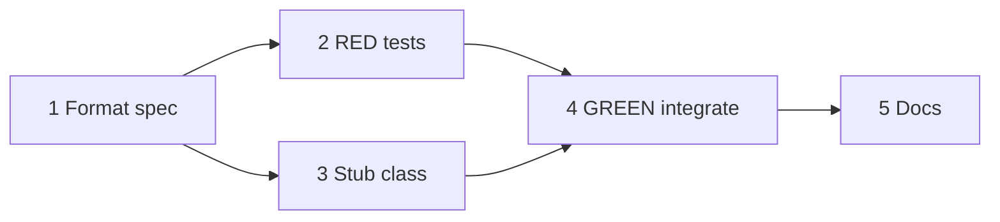

## Initial User Prompt

/add-task turn the current build plan into a series of tasks for the Spec driven design workflow

## Description

### Problem statement and goal

`LogHelper` today writes primarily to a **file** and optional queue; interactive runs do not emit a **consistent, machine-parsable** line format on **host streams** comparable to **PoshBot-style** operational logs (timestamp, level, source, message). Operators tailing transcripts lose structure, and agents cannot grep reliably.

**Goal:** Introduce **`SqlPowerDocLogWriter`** (PowerShell **class** in a dedicated script file under `Modules/LogHelper` or sibling `Modules/SqlPowerDocLogging`) that **mirrors** each log event to **host streams** (Information/Warning/Error by level) **and** appends the same canonical line to the log file, with **Pester** coverage. Preserve existing `Write-Log` behavior for current callers by **thin adapter** functions unless this task explicitly gates breaking changes behind parameters.

### In scope

- Class **`SqlPowerDocLogWriter`** with methods e.g. `Info`, `Warn`, `Error`, `Debug` producing **one canonical string format** (documented regex in `tests/README.md`).
- **File append** with UTF-8, shared lock pattern consistent with `LogHelper` (or delegate to existing queue after enqueue of formatted line — choose minimal integration path in implementation).
- **Host mirror:** `Write-Information`, `Write-Warning`, `Write-Error` (non-terminating) mapped by severity.
- **TDD:** **`[RED]` commit** — failing tests for format + file line; **`[GREEN]` commit** — class + adapter.
- Tests in **`tests/SqlPowerDocLogWriter.test.ps1`** (or extend `LogHelper.test.ps1` if class lives inside LogHelper module).

### Out of scope

- Replacing every `Write-Log` callsite in `SqlServerInventory.psm1` (later tasks).
- Serilog/NLog external dependencies.
- Centralized cloud log shipping.

### Risks and assumptions

| Risk | Mitigation |
|------|------------|
| Circular import LogHelper ↔ new class | Place class in `.psm1` dot-sourced order or separate `Classes/LogWriter.ps1` loaded first. |
| PS 5.1 support | Document PS7+ for new API; guard `class` usage if 5.1 must load module (unlikely for modernization path). |

**Skill / analysis reference:** [.specs/analysis/analysis-implement-log-writer-poshbot-style.md](../../../.specs/analysis/analysis-implement-log-writer-poshbot-style.md).

## Research notes (Phase 2a)

- PoshBot-style lines: ISO-8601 timestamp, UPPER severity, bracketed source, message.
- Pester: test **string** output via temp file, not host colors.

## Codebase analysis (Phase 2b)

- `Modules/LogHelper/LogHelper.psm1` — existing logging pipeline (~260+ lines).
- `tests/LogHelper.test.ps1` — import + `Write-Log` smoke pattern to mirror.

## Business analysis (Phase 2c)

Structured logs reduce MTTR for inventory runs and enable future dashboard/alerts (Pode task).

## Acceptance criteria

1. **Given** `SqlPowerDocLogWriter` instantiated with a temp log path, **when** `Info` is called with message `hello`, **then** file contains one line matching documented pattern including `hello` and severity **INFO**.
2. **Given** `Warn` and `Error` calls, **when** executed, **then** file lines use **WARN** / **ERROR** tokens respectively.
3. **Given** Pester suite, **when** `tests/Run-AllTests.ps1` runs, **then** exit code **0** and new tests pass without SQL/SMO.
4. **Given** existing `LogHelper` tests, **when** suite runs, **then** they still pass (no regression).
5. **Given** documentation in `tests/README.md`, **when** a contributor reads regex/field list, **then** they can validate output without Excel or SQL tools.

## Architecture Overview

### Solution strategy

1. Add **`Classes/SqlPowerDocLogWriter.ps1`** (or embed in `LogHelper.psm1` if team avoids extra file — prefer separate file for testability).
2. **RED:** Pester asserts format + file persistence.
3. **GREEN:** Implement class; optional `Write-LogStructured` cmdlet delegating to class.
4. Document format and severity mapping.

### Key decisions

| Decision | Rationale |
|----------|-----------|
| Class-first | Matches user PowerShell standards and isolates formatting. |
| File-first tests | Deterministic vs mocking host streams. |

### Components

| Path | Action |
|------|--------|
| `Modules/LogHelper/` or `Modules/SqlPowerDocLogging/` | Add class + export |
| `tests/SqlPowerDocLogWriter.test.ps1` | Create |
| `tests/README.md` | Update — line format spec |

## Parallel Execution Plan

**Step 1** (research/format spec) then **parallel** **Step 2** (RED tests) and **Step 3** (class skeleton stub); merge **Step 4** GREEN.

## Implementation Process

### Step 1: Document canonical log line format

**Dependencies:** None  
**Success criteria:** Subsection in `tests/README.md` with example lines and field order.

#### Verification

**Level:** Single Judge | **Threshold:** 4.0/5.0

---

### Step 2: RED — failing tests for writer

**Dependencies:** 1  
**Success criteria:** `tests/SqlPowerDocLogWriter.test.ps1` fails (missing type or wrong format). **Commit message** includes `[RED]`.

#### Verification

**Level:** Single Judge | **Threshold:** 4.5/5.0  
**Rubric:** RED validity 0.35, Pester5 0.25, isolation 0.20, determinism 0.20

---

### Step 3: GREEN — implement `SqlPowerDocLogWriter`

**Dependencies:** 2  
**Success criteria:** All writer tests pass; host mirror smoke (optional assert via `-InformationVariable`). **Commit** `[GREEN]`.

#### Verification

**Level:** Single Judge | **Threshold:** 4.5/5.0

---

### Step 4: Adapter + regression

**Dependencies:** 3  
**Success criteria:** Optional public function documented; `LogHelper.test.ps1` still green.

#### Verification

**Level:** Single Judge | **Threshold:** 4.5/5.0

---

## Verification Summary

| Step | Level | Threshold |
|------|-------|-----------|
| 1 | Judge | 4.0 |
| 2 | Judge | 4.5 |
| 3 | Judge | 4.5 |
| 4 | Judge | 4.5 |

## Definition of Done

- [ ] `[RED]` then `[GREEN]` commits recorded for writer tests.
- [ ] `Run-AllTests.ps1` exits 0.
- [ ] Format documented.

## Plan phase completion

- [x] Research / analysis / architecture / decomposition / parallelize / verifications

**Plan judge score (orchestrator):** 4.6/5.0
