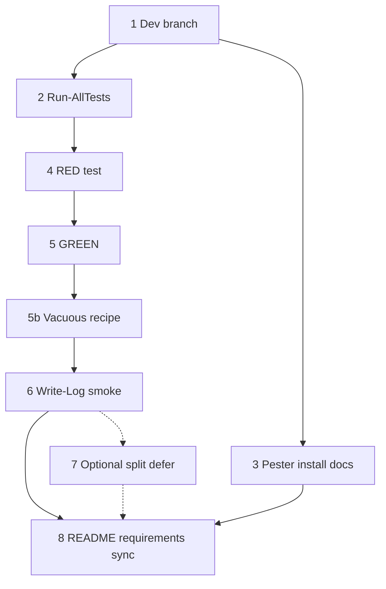

## Initial User Prompt

/add-task turn the current build plan into a series of tasks for the Spec driven design workflow

## Description

### Problem statement and goal

The repository is moving to spec-driven delivery, but there is no agreed **integration branch for ongoing development**, no **repeatable automated test entrypoint**, and no **documented baseline** for validating changes. Without these, contributors cannot consistently run tests, and future class-based refactors lack a stable foundation.

**Goal:** Establish a **development integration branch**, a **Pester 5 test harness** with a single documented entry command, and **baseline tests** against **LogHelper** (smallest shared module) so subsequent tasks can rely on RED/GREEN TDD without requiring SQL Server or SMO for the default suite.

### In scope

- Long-lived **`dev`** branch from current default branch (`master` or `main`). **Do not** introduce `develop` in parallel—use `dev` only for this modernization program.
- **`tests/Run-AllTests.ps1`** invoking **`Invoke-Pester`** with explicit **`Run.Path`**, **`-CI`** (or equivalent exit semantics), discovering tests under `tests/`.
- **At least one Pester test file** (e.g. `tests/LogHelper.test.ps1` per repo naming preference, or `LogHelper.Tests.ps1`) proving module import from **`Modules/LogHelper`** and **`Write-Log`** smoke (temp log file).
- **RED then GREEN** commits encouraged: `[RED]` failing test, `[GREEN]` minimal fix.
- **Contributor docs**: `README.md` and [`requirements.md`](../../../requirements.md) (from this task file: three levels up to repo root) updated with minimum PowerShell version, Pester install, and how to run tests.

### Out of scope

- Rewriting LogHelper internals or full **Public/Private/Classes** split (optional follow-up only if import path cannot be made testable otherwise).
- CI pipeline YAML (optional later).
- Tests that require SQL Server, SSMS, SMO, RSAT, or Excel.
- Fixing **RDS-Manager** missing `.psd1` (note as debt only).

### Risks and assumptions

| Risk | Mitigation |
|------|------------|
| Pester 4 vs 5 on contributor machines | Document `Install-Module Pester -MinimumVersion 5.0.0 -Scope CurrentUser`; script checks major version. |
| Module path not resolving from `tests/` | Prepend repo `Modules` to `$env:PSModulePath` inside `Run-AllTests.ps1` or tests use `Import-Module` with **literal path** to `LogHelper.psd1`. |
| LogHelper async queue | Test flushes via module unload or bounded wait documented in test comments. |

**Skill / analysis reference:** [.specs/analysis/analysis-bootstrap-dev-branch-pester-module-skeleton.md](../../../.specs/analysis/analysis-bootstrap-dev-branch-pester-module-skeleton.md).

## Research notes (Phase 2a)

- Pester 5: [Invoke-Pester](https://pester.dev/docs/commands/Invoke-Pester), `-CI`, `Run.Path`, `Run.Exit` per [configuration](https://pester.dev/docs/usage/configuration).
- Modules: [about_Classes](https://learn.microsoft.com/powershell/module/microsoft.powershell.core/about/about_classes) — load order; dot-source **Classes before Public** when split lands in later tasks.
- Commits: [Conventional Commits](https://www.conventionalcommits.org/) — map RED→`test:`, GREEN→`feat:`/`fix:` or explicit `[RED]`/`[GREEN]` prefixes per team preference.

## Codebase analysis (Phase 2b)

- **Modules:** LogHelper, NetworkScan, NetShell, RDS-Manager (no .psd1), SqlServerDatabaseEngineInformation, SqlServerInventory, WindowsInventory, WindowsMachineInformation.
- **No** `*.test.ps1` today; **no** `tests/` folder.
- **First test target:** `Modules/LogHelper` (~260 lines), imported by root scripts. **Exported commands (verify in `LogHelper.psm1`):** `Set-LogFile`, `Set-LoggingPreference`, `Set-LogQueue`, `Get-LogFile`, `Get-LoggingPreference`, `Write-Log`.

## Business analysis (Phase 2c)

Problem, scope, risks, and acceptance criteria below are the refined business analysis for this chore.

## Acceptance criteria

1. **Given** a clone on documented minimum PowerShell, **when** the contributor checks out **`dev`**, **then** branch purpose is documented in README or CONTRIBUTING.
2. **Given** repo root, **when** the contributor runs the documented test command, **then** Pester runs and exit code reflects pass/fail.
3. **Given** tests run, **when** LogHelper tests execute, **then** `Import-Module` for LogHelper succeeds without SQL/SMO.
4. **Given** a passing suite, **when** a controlled break is introduced to LogHelper import (see Step 5b regression recipe), **then** the suite fails.
5. **Given** a contributor without SQL tools, **when** they run the default test command, **then** it completes without those dependencies.
6. **Given** README, **when** a new contributor searches for tests, **then** install + run instructions are found within two clicks from repo root.

## Architecture Overview

### Solution strategy

- Add **`tests/Run-AllTests.ps1`** as the single entry; configure Pester 5 with explicit paths and CI-friendly exit behavior.
- Target **LogHelper** first: import-by-path from `Modules/LogHelper/LogHelper.psd1`, then assert **`Write-Log`** writes to a temp file under `standard` logging preference.
- Create **`dev`** branch for all modernization work; document in README.
- Defer optional **LogHelper Public/Private split** unless import cannot be tested without it.

### Key decisions

| Decision | Rationale |
|----------|-----------|
| LogHelper first | Smallest module; already imported everywhere. |
| `tests/*.test.ps1` or `*.Tests.ps1` | Align `Run.TestExtension` in Pester config with chosen pattern. |
| Import by path in tests | Avoids depending on `$PSModulePath` install layout. |
| No SQL in default suite | Meets DoD for contributor machines. |

### Components

| Path | Action |
|------|--------|
| `tests/Run-AllTests.ps1` | Create |
| `tests/LogHelper.test.ps1` | Create (Pester 5) |
| `README.md` | Update — Running tests |
| `requirements.md` | Update — Pester + PS version |
| `dev` branch | Create (git) |

## Parallel Execution Plan

**MUST** run **Step 2** and **Step 3** in parallel after Step 1 completes (harness vs install docs are independent).

**Critical path:** 1 → 2 → 4 → 5 → 5b → 6 → 8 (Step 3 merges into 8).

| Step | Suggested agent |
|------|-----------------|
| 1,2,4,5,6,7 | developer |
| 3,8 | tech-writer |

## Implementation Process

### Step 1: Create and push `dev` branch

**Dependencies:** None  
**Success criteria:**

- [ ] `git checkout -b dev` from default branch (`master` or `main`).
- [ ] Branch exists locally; `git push -u origin dev` when remote available.

**Risks:** Remote permission; default branch name mismatch — detect with `git symbolic-ref refs/remotes/origin/HEAD` or document.

**Expected output:** Git ref `dev`; no file changes required.

#### Verification

**Level:** None  
**Rationale:** Git-only outcome; verify via success criteria checklist.

---

### Step 2: Add `tests/Run-AllTests.ps1` Pester harness

**Dependencies:** 1  
**Success criteria:**

- [ ] Script sets `$ErrorActionPreference = 'Stop'` where appropriate.
- [ ] Invokes `Invoke-Pester` with `Run.Path` = `tests`, Pester 5+, exit non-zero on failure (`-CI` or `Run.Exit`).
- [ ] Resolves repo root via `$PSScriptRoot`.

**Risks:** Wrong working directory — document run from repo root only.

**Expected output:** `tests/Run-AllTests.ps1`

#### Verification

**Level:** Single Judge  
**Artifact:** `tests/Run-AllTests.ps1`  
**Threshold:** 4.5/5.0  

**Rubric:**

| Criterion | Weight | Description |
|-----------|--------|-------------|
| CI exit semantics | 0.30 | Non-zero on failure, zero on pass; matches Pester 5 usage. |
| Discovery and paths | 0.25 | Resolves repo root; discovers tests under `tests/`. |
| Pester 5 alignment | 0.20 | No silent Pester 4 assumptions. |
| Operability | 0.15 | Runnable as documented; actionable errors. |
| Maintainability | 0.10 | Minimal comments; matches repo style. |

---

### Step 3: Document Pester installation

**Dependencies:** 1 (parallel with 2)  
**Success criteria:**

- [ ] `Install-Module Pester -MinimumVersion 5.0.0` (or scoped variant) documented.
- [ ] Minimum PowerShell version stated (target **7+** aligned with modernization plan).

**Expected output:** New subsection in `README.md` or short `tests/README.md` linked from README; update `requirements.md`.

#### Verification

**Level:** Single Judge  
**Artifacts:** `README.md`, `requirements.md` (partial — full sync in Step 8)  
**Threshold:** 4.0/5.0  

**Rubric:**

| Criterion | Weight | Description |
|-----------|--------|-------------|
| Install accuracy | 0.35 | Correct module name and minimum major version. |
| Run path clarity | 0.30 | Contributor can find test command after reading. |
| Scope | 0.20 | CurrentUser vs admin, execution policy if needed. |
| Consistency | 0.15 | Matches actual `Run-AllTests.ps1` behavior. |

---

### Step 4: RED — failing LogHelper import test

**Dependencies:** 2  
**Success criteria:**

- [ ] `tests/LogHelper.test.ps1` (or `.Tests.ps1` matching config) contains a test that **fails** before harness/path fix (TDD).
- [ ] Uses `BeforeAll` / `Import-Module` with path to `Modules/LogHelper/LogHelper.psd1`.

**Expected output:** `tests/LogHelper.test.ps1`

#### Verification

**Level:** Single Judge  
**Artifact:** `tests/LogHelper.test.ps1`  
**Threshold:** 4.5/5.0  

**Rubric:**

| Criterion | Weight | Description |
|-----------|--------|-------------|
| RED validity | 0.30 | Deliberate failure before GREEN; then passes after Step 5. |
| Path strategy | 0.25 | Deterministic path from repo root on Windows PS 5.1+ and PS 7+. |
| Pester 5 structure | 0.20 | `Describe`/`It`/`Should` v5 idioms. |
| Isolation | 0.15 | Minimal global state mutation. |
| Determinism | 0.10 | No machine-specific hard-coded paths. |

---

### Step 5: GREEN — make import test pass

**Dependencies:** 4  
**Success criteria:**

- [ ] `Invoke-Pester` / `Run-AllTests.ps1` exits 0 with LogHelper import test passing.
- [ ] Prefer fixing harness (`PSModulePath` prepend or `-File` resolution) over large LogHelper rewrites.

**Expected output:** Updated `tests/Run-AllTests.ps1` and/or `tests/LogHelper.test.ps1`

#### Verification

**Level:** Single Judge  
**Artifacts:** `tests/Run-AllTests.ps1`, `tests/LogHelper.test.ps1`  
**Threshold:** 4.5/5.0  

**Rubric:**

| Criterion | Weight | Description |
|-----------|--------|-------------|
| Import success | 0.35 | LogHelper loads without manual env hacks for typical dev. |
| Minimal change | 0.25 | Harness-first fixes preferred. |
| Runner integration | 0.20 | Exit codes and discovery remain correct. |
| Cross-version | 0.20 | Works on PS 7+ (and 5.1 if still claimed). |

---

### Step 5b: Regression check for AC4 (vacuous-test guard)

**Dependencies:** 5  
**Success criteria:**

- [ ] Create **`tests/README.md`** if missing. Add subsection **Verify tests are not vacuous** with a **repeatable** recipe: temporarily rename `Modules/LogHelper/LogHelper.psd1` to `LogHelper.psd1.bak`, run `tests/Run-AllTests.ps1`, confirm **non-zero exit**, restore the manifest. Warn: only on `dev`, clean working tree, do not commit the rename.

**Expected output:** `tests/README.md` (subsection **Verify tests are not vacuous**)

#### Verification

**Level:** Single Judge  
**Artifact:** `tests/README.md`  
**Threshold:** 4.0/5.0  

**Rubric:**

| Criterion | Weight | Description |
|-----------|--------|-------------|
| Recipe clarity | 0.50 | Step-by-step; restore step mandatory. |
| AC4 mapping | 0.30 | Explicitly references failing import when manifest missing. |
| Safety | 0.20 | Warns to work only on `dev` / clean working tree. |

---

### Step 6: Smoke test `Write-Log` to temp file

**Dependencies:** 5b  
**Success criteria:**

- [ ] Test calls `Set-LogFile`, `Set-LoggingPreference`, `Write-Log`; asserts file contains message.
- [ ] Handles LogHelper queue flush (unload module or documented wait).

**Expected output:** Extended `tests/LogHelper.test.ps1`

#### Verification

**Level:** Single Judge  
**Artifact:** `tests/LogHelper.test.ps1`  
**Threshold:** 4.5/5.0  

**Rubric:**

| Criterion | Weight | Description |
|-----------|--------|-------------|
| Logging workflow | 0.30 | Full Set-* + Write-Log path exercised. |
| File assertions | 0.30 | Content or substring verified. |
| Cleanup | 0.20 | Temp files and preferences restored. |
| Stability | 0.20 | No flaky timing without documented mitigation. |

---

### Step 7: Optional LogHelper Public/Private split — default DEFER

**Dependencies:** 6  
**Success criteria:**

- [ ] Record **defer** decision in **`tests/README.md`** only (subsection **Optional module layout**); **or** execute minimal split if Step 5 required it.

**Expected output:** Note file or split layout under `Modules/LogHelper/`

#### Verification

**Level:** Single Judge  
**Threshold:** 4.0/5.0  

**Rubric:**

| Criterion | Weight | Description |
|-----------|--------|-------------|
| Decision clarity | 0.40 | Defer vs split explicit. |
| Test stability | 0.35 | Full suite still passes. |
| Scope | 0.25 | No unnecessary churn. |

---

### Step 8: Final documentation sync

**Dependencies:** 3, 6, 5b, (7 if executed)  
**Success criteria:**

- [ ] README: branch name **`dev`**, **Running tests** with exact command; link to `tests/README.md` for vacuous-test recipe.
- [ ] `requirements.md`: Pester + PowerShell minimum.

**Expected output:** `README.md`, `requirements.md`

#### Verification

**Level:** Single Judge  
**Artifacts:** `README.md`, `requirements.md`  
**Threshold:** 4.0/5.0  

**Rubric:**

| Criterion | Weight | Description |
|-----------|--------|-------------|
| Running tests | 0.35 | Command copy-pasteable. |
| Prerequisites | 0.30 | Accurate Pester + PS version. |
| Clone-to-run | 0.20 | Story holds on clean clone. |
| Scope | 0.15 | Minimal edits to legacy prose. |

---

## Verification Summary

| Step | Level | Threshold | Artifacts |
|------|-------|-----------|-----------|
| 1 | None | — | Git |
| 2 | Single Judge | 4.5/5.0 | `tests/Run-AllTests.ps1` |
| 3 | Single Judge | 4.0/5.0 | README, requirements |
| 4 | Single Judge | 4.5/5.0 | `tests/LogHelper.test.ps1` |
| 5 | Single Judge | 4.5/5.0 | harness + test |
| 5b | Single Judge | 4.0/5.0 | `tests/README.md` |
| 6 | Single Judge | 4.5/5.0 | `tests/LogHelper.test.ps1` |
| 7 | Single Judge | 4.0/5.0 | `tests/README.md` or LogHelper layout |
| 8 | Single Judge | 4.0/5.0 | README, requirements |

## Definition of Done (Task Level)

- [ ] `dev` branch created and documented.
- [ ] `tests/Run-AllTests.ps1` runs Pester 5 with correct exit codes.
- [ ] LogHelper import test passes; fails when import intentionally broken.
- [ ] `Write-Log` smoke test passes with file assertion.
- [ ] README + requirements updated.
- [ ] `Invoke-Pester` / `Run-AllTests.ps1` executed successfully in this environment after implementation.

## Plan phase completion

- [x] Research
- [x] Codebase analysis
- [x] Business analysis
- [x] Architecture synthesis
- [x] Decomposition
- [x] Parallelize
- [x] Verifications defined

**Plan judge score (orchestrator):** 4.6/5.0 (meets ≥ 4.5 threshold; `plan_max_iterations`: 3)
