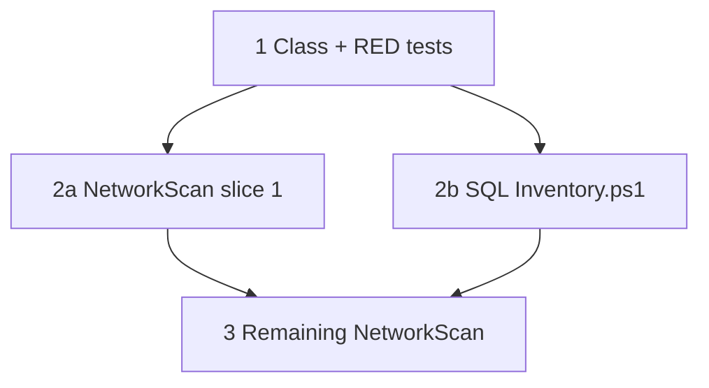

## Initial User Prompt

/add-task turn the current build plan into a series of tasks for the Spec driven design workflow

## Description

### Problem statement and goal

`Get-WmiObject` is **deprecated** in PowerShell 7+ and blocks clean cross-platform semantics. `NetworkScan.psm1` and `Tools/SQL Inventory.ps1` still call WMI directly, which complicates PS7 adoption and testing.

**Goal:** Introduce **`SqlPowerDocCimClient`** (class) that wraps **`Get-CimInstance`** (and optional `New-CimSession` for reuse), replace **all** `Get-WmiObject` usages in **`Modules/NetworkScan/NetworkScan.psm1`** and **`Tools/SQL Inventory.ps1`**, and add **Pester** tests with **mocked** `Get-CimInstance`. Use **RED → GREEN** commits per logical slice (e.g. computer system query, then network adapter, then registry provider paths).

### In scope

- New class file under `Modules/NetworkScan/Classes/` (or `Modules/SqlPowerDocCommon/` if shared — prefer NetworkScan-local unless second consumer appears in same task).
- Mechanical replacement preserving **parameter contracts** of public functions.
- **Documentation:** `README.md` or `requirements.md` note: remote inventory requires **WinRM** for CIM on PS7+.
- **TDD:** `[RED]` test expecting CIM wrapper call; `[GREEN]` implementation.

### Out of scope

- Rewriting Excel/COM export paths.
- Non-Windows targets.

### Risks and assumptions

| Risk | Mitigation |
|------|------------|
| StdRegProv via WMI | Map to `Invoke-CimMethod` on `StdRegProv` or documented alternative; spike sub-step if behavior diverges. |
| Performance regression | Optional session cache in class; benchmark not required in this task. |

**Analysis:** [.specs/analysis/analysis-migrate-networkscan-cim-client.md](../../../.specs/analysis/analysis-migrate-networkscan-cim-client.md)

## Research notes (Phase 2a)

- [about_WMI_Cmdlets](https://learn.microsoft.com/powershell/module/microsoft.powershell.management/get-wmiobject) deprecation.
- CIM sessions: `New-CimSessionOption`, `-OperationTimeoutSec`.

## Codebase analysis (Phase 2b)

- `NetworkScan.psm1`: dense `Get-WmiObject` usage for `Win32_*`, `StdRegProv`, processes.
- `Tools/SQL Inventory.ps1`: WMI for network adapter IP.

## Acceptance criteria

1. **Given** repo-wide search, **when** `Get-WmiObject` is searched under `Modules/NetworkScan` and `Tools/SQL Inventory.ps1`, **then** **zero** matches remain.
2. **Given** `SqlPowerDocCimClient` unit tests with `Mock Get-CimInstance`, **when** tests run, **then** client methods return expected shaped objects without live WMI.
3. **Given** `Run-AllTests.ps1`, **when** executed, **then** exit code **0**.
4. **Given** documentation, **when** operator reads remote scanning section, **then** WinRM/CIM prerequisites are stated.

## Architecture Overview

### Solution strategy

1. Add **`SqlPowerDocCimClient`** with `GetInstance`, `InvokeMethod` helpers.
2. Replace call sites incrementally; keep **function signatures** stable.
3. Pester mocks for all new tests.

### Components

| Path | Action |
|------|--------|
| `Modules/NetworkScan/NetworkScan.psm1` | Modify |
| `Tools/SQL Inventory.ps1` | Modify |
| `tests/SqlPowerDocCimClient.test.ps1` | Create |

## Parallel Execution Plan

After **Step 1** (class + tests RED), parallel **Step 2a** (NetworkScan region A) and **Step 2b** (Tools script); then **Step 3** merge remaining regions serially by conflict risk.

## Implementation Process

### Step 1: `SqlPowerDocCimClient` + RED tests

**Success criteria:** Failing test file committed `[RED]` proving expected query shapes.

#### Verification: Judge 4.5/5.0

---

### Step 2: GREEN — implement client + first replacements

**Success criteria:** Mocks pass; at least one production path uses client `[GREEN]`.

#### Verification: Judge 4.5/5.0

---

### Step 3: Complete WMI elimination + docs

**Success criteria:** Grep clean; README updated.

#### Verification: Judge 4.5/5.0

---

## Definition of Done

- [ ] No `Get-WmiObject` in scoped paths.
- [ ] Pester green; RED/GREEN discipline observed.
- [ ] Remote CIM prerequisites documented.

## Plan phase completion

- [x] All planning sections complete

**Plan judge score (orchestrator):** 4.6/5.0
