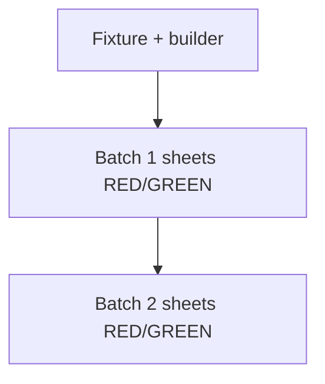

## Initial User Prompt

/add-task turn the current build plan into a series of tasks for the Spec driven design workflow

## Description

### Problem statement and goal

`Export-SqlServerInventoryDatabaseEngineConfigToExcel` builds a **55-worksheet** workbook via **COM Excel** and `Microsoft.Office.Interop.Excel` (`SqlServerInventory.psm1` ~4619+). This is the largest maintenance and automation liability in the SQL inventory export surface.

**Goal:** Replace the COM implementation with **`ImportExcel`** (`Export-Excel`), using a **workbook builder class** (reuse or generalize the pattern from `rewrite-windows-inventory-importexcel.feature.md`). Eliminate **`New-Object -Com Excel.Application`** and **`Add-Type -AssemblyName Microsoft.Office.Interop.Excel`** from **this** function’s code path. Enforce **TDD** with incremental **RED/GREEN** per worksheet group (e.g. Overview/Services batch first).

### In scope

- Function `Export-SqlServerInventoryDatabaseEngineConfigToExcel` only (inner implementation).
- Shared builder **if** already introduced; otherwise introduce `SqlPowerDocSqlInventoryWorkbookBuilder` here and refactor Windows builder later in `split-modules` task.
- Pester tests with **fixture** inventory object; optional **snapshot** of expected worksheet tab names (ordered subset for CI).

### Out of scope

- `Export-SqlServerInventoryDatabaseEngineAssessmentToExcel` and `DbObjects` (next task).
- Changing SMO collection logic.

### Risks and assumptions

| Risk | Mitigation |
|------|------------|
| Sheet parity | Checklist worksheet-by-worksheet in task PR description. |
| Runtime | Measure; batch `Export-Excel` calls; avoid mega-hashtables. |

**Analysis:** [.specs/analysis/analysis-rewrite-database-engine-config-importexcel.md](../../../.specs/analysis/analysis-rewrite-database-engine-config-importexcel.md)

## Acceptance criteria

1. **Given** fixture `SqlServerInventory`, **when** export runs to temp path, **then** `.xlsx` exists and **Import-Excel** reads worksheets matching **minimum agreed subset** (listed in test file).
2. **Given** static analysis, **when** searching inside the config export function region, **then** no COM/Interop Excel references remain.
3. **Given** full Pester run with ImportExcel installed, **when** executed, **then** exit 0.
4. **Given** each merged slice, **when** history is inspected, **then** at least one **`[RED]`** test commit precedes corresponding **`[GREEN]`** implementation commit for that slice.

## Architecture Overview

- **Phased strangler:** Region-based replacement behind same cmdlet name.
- **Class** holds worksheet metadata and row payloads (arrays of PSCustomObject or DataTable).

## Parallel Execution Plan

After fixture + builder shell, **parallel** implement two worksheet batches (Agent A / Agent B) if merge conflicts low; otherwise **serial** batches with strict file locking communication.

## Implementation Process

### Steps 1–2: Fixture + RED tests for batch 1

**Verification:** Judge 4.5/5.0

### Step 3: GREEN batch 1

**Verification:** Judge 4.5/5.0

### Steps 4–N: Repeat for remaining batches until COM gone

**Verification:** Judge 4.5/5.0 each batch

### Final: Grep gate + docs

**Verification:** Judge 4.0/5.0

## Definition of Done

- [ ] COM/Interop removed from config export path.
- [ ] Documented ImportExcel dependency.
- [ ] Incremental RED/GREEN proven in git history.

## Plan phase completion

- [x] Research / analysis / architecture / decomposition / parallelize / verifications

**Plan judge score (orchestrator):** 4.6/5.0
