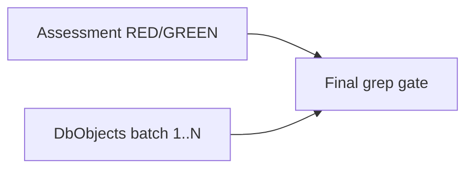

## Initial User Prompt

/add-task turn the current build plan into a series of tasks for the Spec driven design workflow

## Description

### Problem statement and goal

Two exports in **`SqlServerInventory.psm1`** still use **COM Excel**:

- `Export-SqlServerInventoryDatabaseEngineAssessmentToExcel` (~10697, **6** worksheets)
- `Export-SqlServerInventoryDatabaseEngineDbObjectsToExcel` (~11206, **74** worksheets)

**Goal:** Migrate **both** to **`ImportExcel`** using the shared **workbook builder** pattern established in the Database Engine Config task. Remove COM/Interop from both code paths. Use **TDD** with **RED/GREEN** cycles; **Assessment** may complete in one cycle; **DbObjects** requires **multiple** batched cycles.

### In scope

- Both functions’ `process` bodies; preserve public parameters and behavioral contracts where documented.
- New/extended tests under `tests/` with focused fixtures (`DatabaseEngineAssessment`, `SqlServerInventory`).
- Grep gate: no `New-Object -Com Excel.Application` in either function region.

### Out of scope

- Inventory **collection** (SMO) changes.
- Windows inventory export.

### Risks and assumptions

| Risk | Mitigation |
|------|------------|
| 74 sheets | Strict batching; worksheet checklist in PR. |
| Merge conflicts | Serialize if two devs touch same psm1 regions — task owner merges batches. |

**Analysis:** [.specs/analysis/analysis-rewrite-dbobjects-assessment-importexcel.md](../../../.specs/analysis/analysis-rewrite-dbobjects-assessment-importexcel.md)

## Acceptance criteria

1. **Given** Assessment fixture, **when** `Export-SqlServerInventoryDatabaseEngineAssessmentToExcel` runs, **then** xlsx valid and COM absent from that function.
2. **Given** DbObjects fixture + batch tests, **when** each batch completes, **then** tests pass and COM usage shrinks until zero in that function.
3. **Given** full suite, **when** `Run-AllTests.ps1`, **then** exit 0 (ImportExcel present).
4. **Given** git history, **when** reviewed, **then** RED precedes GREEN for each claimed batch.

## Parallel Execution Plan

- **Assessment** and **DbObjects** can run in **parallel branches** if different line regions — recommend **sequential** implementation in one working tree to reduce `psm1` merge pain, or **parallel agents** with explicit line-range ownership.

## Implementation Process

### Phase A: Assessment export (RED → GREEN → verify)

**Verification:** Judge 4.5/5.0

### Phase B: DbObjects batch 1..N (RED/GREEN each)

**Verification:** Judge 4.5/5.0 per batch

### Phase C: Documentation + worksheet parity checklist

**Verification:** Judge 4.0/5.0

## Definition of Done

- [ ] Both exports COM-free.
- [ ] Batched TDD for DbObjects documented.
- [ ] Pester green.

## Plan phase completion

- [x] Research / analysis / architecture / decomposition / parallelize / verifications

**Plan judge score (orchestrator):** 4.6/5.0
