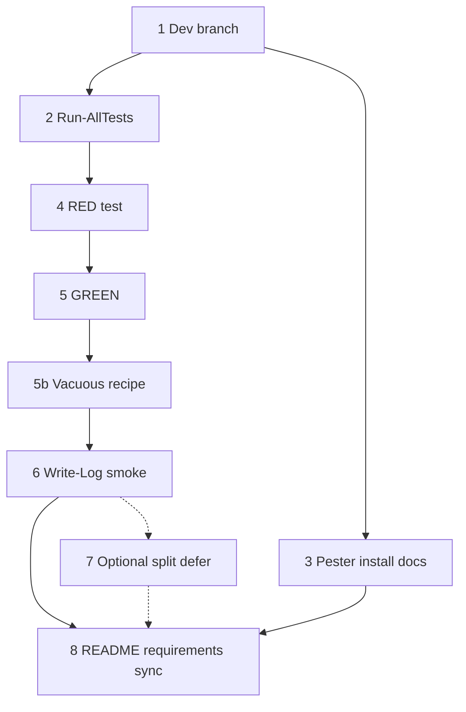
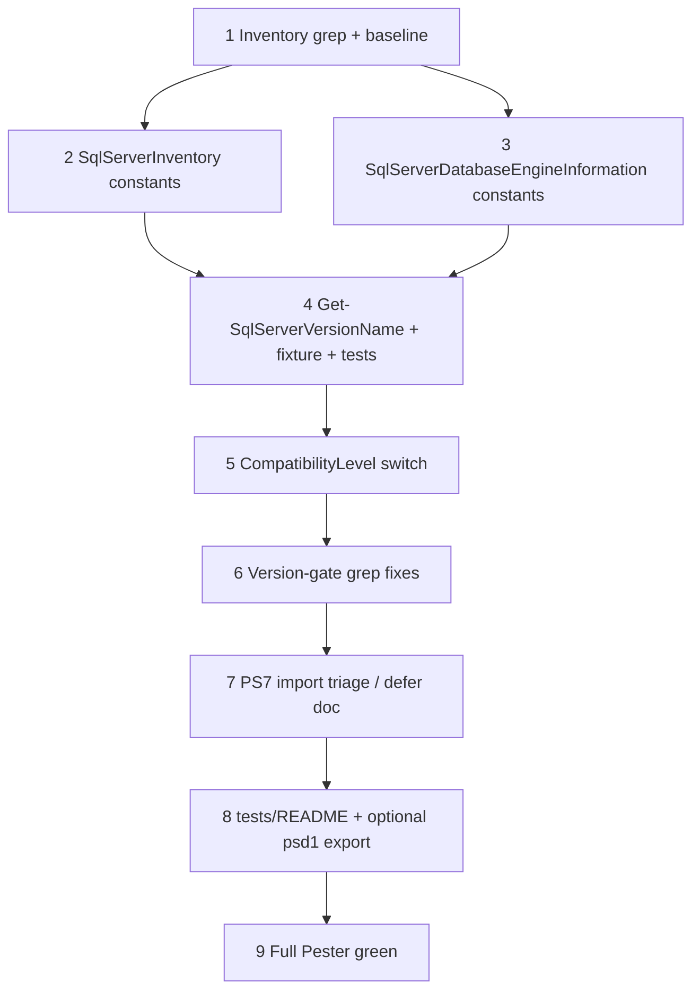

## Initial User Prompt

/add-task turn the current build plan into a series of tasks for the Spec driven design workflow

## Description

### Problem statement and goal

The repository is moving to spec-driven delivery, but there is no agreed **integration branch for ongoing development**, no **repeatable automated test entrypoint**, and no **documented baseline** for validating changes. Without these, contributors cannot consistently run tests, and future class-based refactors lack a stable foundation.

**Goal:** Establish a **development integration branch**, a **Pester 5 test harness** with a single documented entry command, and **baseline tests** against **LogHelper** (smallest shared module) so subsequent tasks can rely on RED/GREEN TDD without requiring SQL Server or SMO for the default suite.

### In scope

- Long-lived **`dev`** branch from current default branch (`master` or `main`). **Do not** introduce `develop` in parallel—use `dev` only for this modernization program.
- **`tests/Run-AllTests.ps1`** invoking **`Invoke-Pester`** with explicit **`Run.Path`**, **`-CI`** (or equivalent exit semantics), discovering tests under `tests/`.
- **At least one Pester test file** (e.g. `tests/LogHelper.test.ps1` per repo naming preference, or `LogHelper.Tests.ps1`) proving module import from **`Modules/LogHelper`** and **`Write-Log`** smoke (temp log file).
- **RED then GREEN** commits encouraged: `[RED]` failing test, `[GREEN]` minimal fix.
- **Contributor docs**: `README.md` and [`requirements.md`](../../../requirements.md) (from this task file: three levels up to repo root) updated with minimum PowerShell version, Pester install, and how to run tests.

### Out of scope

- Rewriting LogHelper internals or full **Public/Private/Classes** split (optional follow-up only if import path cannot be made testable otherwise).
- CI pipeline YAML (optional later).
- Tests that require SQL Server, SSMS, SMO, RSAT, or Excel.
- Fixing **RDS-Manager** missing `.psd1` (note as debt only).

### Risks and assumptions

| Risk | Mitigation |
|------|------------|
| Pester 4 vs 5 on contributor machines | Document `Install-Module Pester -MinimumVersion 5.0.0 -Scope CurrentUser`; script checks major version. |
| Module path not resolving from `tests/` | Prepend repo `Modules` to `$env:PSModulePath` inside `Run-AllTests.ps1` or tests use `Import-Module` with **literal path** to `LogHelper.psd1`. |
| LogHelper async queue | Test flushes via module unload or bounded wait documented in test comments. |

## Research notes (Phase 2a)

- Pester 5: [Invoke-Pester](https://pester.dev/docs/commands/Invoke-Pester), `-CI`, `Run.Path`, `Run.Exit` per [configuration](https://pester.dev/docs/usage/configuration).
- Modules: [about_Classes](https://learn.microsoft.com/powershell/module/microsoft.powershell.core/about/about_classes) — load order; dot-source **Classes before Public** when split lands in later tasks.
- Commits: [Conventional Commits](https://www.conventionalcommits.org/) — map RED→`test:`, GREEN→`feat:`/`fix:` or explicit `[RED]`/`[GREEN]` prefixes per team preference.

## Codebase analysis (Phase 2b)

- **Modules:** LogHelper, NetworkScan, NetShell, RDS-Manager (no .psd1), SqlServerDatabaseEngineInformation, SqlServerInventory, WindowsInventory, WindowsMachineInformation.
- **No** `*.test.ps1` today; **no** `tests/` folder.
- **First test target:** `Modules/LogHelper` (~260 lines), imported by root scripts. **Exported commands (verify in `LogHelper.psm1`):** `Set-LogFile`, `Set-LoggingPreference`, `Set-LogQueue`, `Get-LogFile`, `Get-LoggingPreference`, `Write-Log`.

## Business analysis (Phase 2c)

Problem, scope, risks, and acceptance criteria below are the refined business analysis for this chore.

## Acceptance criteria

1. **Given** a clone on documented minimum PowerShell, **when** the contributor checks out **`dev`**, **then** branch purpose is documented in README or CONTRIBUTING.
2. **Given** repo root, **when** the contributor runs the documented test command, **then** Pester runs and exit code reflects pass/fail.
3. **Given** tests run, **when** LogHelper tests execute, **then** `Import-Module` for LogHelper succeeds without SQL/SMO.
4. **Given** a passing suite, **when** a controlled break is introduced to LogHelper import (see Step 5b regression recipe), **then** the suite fails.
5. **Given** a contributor without SQL tools, **when** they run the default test command, **then** it completes without those dependencies.
6. **Given** README, **when** a new contributor searches for tests, **then** install + run instructions are found within two clicks from repo root.

## Architecture Overview

### Solution strategy

- Add **`tests/Run-AllTests.ps1`** as the single entry; configure Pester 5 with explicit paths and CI-friendly exit behavior.
- Target **LogHelper** first: import-by-path from `Modules/LogHelper/LogHelper.psd1`, then assert **`Write-Log`** writes to a temp file under `standard` logging preference.
- Create **`dev`** branch for all modernization work; document in README.
- Defer optional **LogHelper Public/Private split** unless import cannot be tested without it.

### Key decisions

| Decision | Rationale |
|----------|-----------|
| LogHelper first | Smallest module; already imported everywhere. |
| `tests/*.test.ps1` or `*.Tests.ps1` | Align `Run.TestExtension` in Pester config with chosen pattern. |
| Import by path in tests | Avoids depending on `$PSModulePath` install layout. |
| No SQL in default suite | Meets DoD for contributor machines. |

### Components

| Path | Action |
|------|--------|
| `tests/Run-AllTests.ps1` | Create |
| `tests/LogHelper.test.ps1` | Create (Pester 5) |
| `README.md` | Update — Running tests |
| `requirements.md` | Update — Pester + PS version |
| `dev` branch | Create (git) |

## Parallel Execution Plan

**MUST** run **Step 2** and **Step 3** in parallel after Step 1 completes (harness vs install docs are independent).

**Critical path:** 1 → 2 → 4 → 5 → 5b → 6 → 8 (Step 3 merges into 8).

| Step | Suggested agent |
|------|-----------------|
| 1,2,4,5,6,7 | developer |
| 3,8 | tech-writer |

## Implementation Process

### Step 1: Create and push `dev` branch

**Dependencies:** None  
**Success criteria:**

- [ ] `git checkout -b dev` from default branch (`master` or `main`).
- [ ] Branch exists locally; `git push -u origin dev` when remote available.

**Risks:** Remote permission; default branch name mismatch — detect with `git symbolic-ref refs/remotes/origin/HEAD` or document.

**Expected output:** Git ref `dev`; no file changes required.

#### Verification

**Level:** None  
**Rationale:** Git-only outcome; verify via success criteria checklist.

---

### Step 2: Add `tests/Run-AllTests.ps1` Pester harness

**Dependencies:** 1  
**Success criteria:**

- [ ] Script sets `$ErrorActionPreference = 'Stop'` where appropriate.
- [ ] Invokes `Invoke-Pester` with `Run.Path` = `tests`, Pester 5+, exit non-zero on failure (`-CI` or `Run.Exit`).
- [ ] Resolves repo root via `$PSScriptRoot`.

**Risks:** Wrong working directory — document run from repo root only.

**Expected output:** `tests/Run-AllTests.ps1`

#### Verification

**Level:** Single Judge  
**Artifact:** `tests/Run-AllTests.ps1`  
**Threshold:** 4.5/5.0  

**Rubric:**

| Criterion | Weight | Description |
|-----------|--------|-------------|
| CI exit semantics | 0.30 | Non-zero on failure, zero on pass; matches Pester 5 usage. |
| Discovery and paths | 0.25 | Resolves repo root; discovers tests under `tests/`. |
| Pester 5 alignment | 0.20 | No silent Pester 4 assumptions. |
| Operability | 0.15 | Runnable as documented; actionable errors. |
| Maintainability | 0.10 | Minimal comments; matches repo style. |

---

### Step 3: Document Pester installation

**Dependencies:** 1 (parallel with 2)  
**Success criteria:**

- [ ] `Install-Module Pester -MinimumVersion 5.0.0` (or scoped variant) documented.
- [ ] Minimum PowerShell version stated (target **7+** aligned with modernization plan).

**Expected output:** New subsection in `README.md` or short `tests/README.md` linked from README; update `requirements.md`.

#### Verification

**Level:** Single Judge  
**Artifacts:** `README.md`, `requirements.md` (partial — full sync in Step 8)  
**Threshold:** 4.0/5.0  

**Rubric:**

| Criterion | Weight | Description |
|-----------|--------|-------------|
| Install accuracy | 0.35 | Correct module name and minimum major version. |
| Run path clarity | 0.30 | Contributor can find test command after reading. |
| Scope | 0.20 | CurrentUser vs admin, execution policy if needed. |
| Consistency | 0.15 | Matches actual `Run-AllTests.ps1` behavior. |

---

### Step 4: RED — failing LogHelper import test

**Dependencies:** 2  
**Success criteria:**

- [ ] `tests/LogHelper.test.ps1` (or `.Tests.ps1` matching config) contains a test that **fails** before harness/path fix (TDD).
- [ ] Uses `BeforeAll` / `Import-Module` with path to `Modules/LogHelper/LogHelper.psd1`.

**Expected output:** `tests/LogHelper.test.ps1`

#### Verification

**Level:** Single Judge  
**Artifact:** `tests/LogHelper.test.ps1`  
**Threshold:** 4.5/5.0  

**Rubric:**

| Criterion | Weight | Description |
|-----------|--------|-------------|
| RED validity | 0.30 | Deliberate failure before GREEN; then passes after Step 5. |
| Path strategy | 0.25 | Deterministic path from repo root on Windows PS 5.1+ and PS 7+. |
| Pester 5 structure | 0.20 | `Describe`/`It`/`Should` v5 idioms. |
| Isolation | 0.15 | Minimal global state mutation. |
| Determinism | 0.10 | No machine-specific hard-coded paths. |

---

### Step 5: GREEN — make import test pass

**Dependencies:** 4  
**Success criteria:**

- [ ] `Invoke-Pester` / `Run-AllTests.ps1` exits 0 with LogHelper import test passing.
- [ ] Prefer fixing harness (`PSModulePath` prepend or `-File` resolution) over large LogHelper rewrites.

**Expected output:** Updated `tests/Run-AllTests.ps1` and/or `tests/LogHelper.test.ps1`

#### Verification

**Level:** Single Judge  
**Artifacts:** `tests/Run-AllTests.ps1`, `tests/LogHelper.test.ps1`  
**Threshold:** 4.5/5.0  

**Rubric:**

| Criterion | Weight | Description |
|-----------|--------|-------------|
| Import success | 0.35 | LogHelper loads without manual env hacks for typical dev. |
| Minimal change | 0.25 | Harness-first fixes preferred. |
| Runner integration | 0.20 | Exit codes and discovery remain correct. |
| Cross-version | 0.20 | Works on PS 7+ (and 5.1 if still claimed). |

---

### Step 5b: Regression check for AC4 (vacuous-test guard)

**Dependencies:** 5  
**Success criteria:**

- [ ] Create **`tests/README.md`** if missing. Add subsection **Verify tests are not vacuous** with a **repeatable** recipe: temporarily rename `Modules/LogHelper/LogHelper.psd1` to `LogHelper.psd1.bak`, run `tests/Run-AllTests.ps1`, confirm **non-zero exit**, restore the manifest. Warn: only on `dev`, clean working tree, do not commit the rename.

**Expected output:** `tests/README.md` (subsection **Verify tests are not vacuous**)

#### Verification

**Level:** Single Judge  
**Artifact:** `tests/README.md`  
**Threshold:** 4.0/5.0  

**Rubric:**

| Criterion | Weight | Description |
|-----------|--------|-------------|
| Recipe clarity | 0.50 | Step-by-step; restore step mandatory. |
| AC4 mapping | 0.30 | Explicitly references failing import when manifest missing. |
| Safety | 0.20 | Warns to work only on `dev` / clean working tree. |

---

### Step 6: Smoke test `Write-Log` to temp file

**Dependencies:** 5b  
**Success criteria:**

- [ ] Test calls `Set-LogFile`, `Set-LoggingPreference`, `Write-Log`; asserts file contains message.
- [ ] Handles LogHelper queue flush (unload module or documented wait).

**Expected output:** Extended `tests/LogHelper.test.ps1`

#### Verification

**Level:** Single Judge  
**Artifact:** `tests/LogHelper.test.ps1`  
**Threshold:** 4.5/5.0  

**Rubric:**

| Criterion | Weight | Description |
|-----------|--------|-------------|
| Logging workflow | 0.30 | Full Set-* + Write-Log path exercised. |
| File assertions | 0.30 | Content or substring verified. |
| Cleanup | 0.20 | Temp files and preferences restored. |
| Stability | 0.20 | No flaky timing without documented mitigation. |

---

### Step 7: Optional LogHelper Public/Private split — default DEFER

**Dependencies:** 6  
**Success criteria:**

- [ ] Record **defer** decision in **`tests/README.md`** only (subsection **Optional module layout**); **or** execute minimal split if Step 5 required it.

**Expected output:** Note file or split layout under `Modules/LogHelper/`

#### Verification

**Level:** Single Judge  
**Threshold:** 4.0/5.0  

**Rubric:**

| Criterion | Weight | Description |
|-----------|--------|-------------|
| Decision clarity | 0.40 | Defer vs split explicit. |
| Test stability | 0.35 | Full suite still passes. |
| Scope | 0.25 | No unnecessary churn. |

---

### Step 8: Final documentation sync

**Dependencies:** 3, 6, 5b, (7 if executed)  
**Success criteria:**

- [ ] README: branch name **`dev`**, **Running tests** with exact command; link to `tests/README.md` for vacuous-test recipe.
- [ ] `requirements.md`: Pester + PowerShell minimum.

**Expected output:** `README.md`, `requirements.md`

#### Verification

**Level:** Single Judge  
**Artifacts:** `README.md`, `requirements.md`  
**Threshold:** 4.0/5.0  

**Rubric:**

| Criterion | Weight | Description |
|-----------|--------|-------------|
| Running tests | 0.35 | Command copy-pasteable. |
| Prerequisites | 0.30 | Accurate Pester + PS version. |
| Clone-to-run | 0.20 | Story holds on clean clone. |
| Scope | 0.15 | Minimal edits to legacy prose. |

---

## Verification Summary

| Step | Level | Threshold | Artifacts |
|------|-------|-----------|-----------|
| 1 | None | — | Git |
| 2 | Single Judge | 4.5/5.0 | `tests/Run-AllTests.ps1` |
| 3 | Single Judge | 4.0/5.0 | README, requirements |
| 4 | Single Judge | 4.5/5.0 | `tests/LogHelper.test.ps1` |
| 5 | Single Judge | 4.5/5.0 | harness + test |
| 5b | Single Judge | 4.0/5.0 | `tests/README.md` |
| 6 | Single Judge | 4.5/5.0 | `tests/LogHelper.test.ps1` |
| 7 | Single Judge | 4.0/5.0 | `tests/README.md` or LogHelper layout |
| 8 | Single Judge | 4.0/5.0 | README, requirements |

## Definition of Done (Task Level)

- [ ] `dev` branch created and documented.
- [ ] `tests/Run-AllTests.ps1` runs Pester 5 with correct exit codes.
- [ ] LogHelper import test passes; fails when import intentionally broken.
- [ ] `Write-Log` smoke test passes with file assertion.
- [ ] README + requirements updated.
- [ ] `Invoke-Pester` / `Run-AllTests.ps1` executed successfully in this environment after implementation.

## Plan phase completion

- [x] Research
- [x] Codebase analysis
- [x] Business analysis
- [x] Architecture synthesis
- [x] Decomposition
- [x] Parallelize
- [x] Verifications defined

**Plan judge score (orchestrator):** _Pending first review ≥ 4.5/5.0_
---
title: Implement SqlPowerDocLogWriter with dual console and file output
depends_on:
  - bootstrap-dev-branch-pester-module-skeleton.chore.md
---

## Initial User Prompt

/add-task turn the current build plan into a series of tasks for the Spec driven design workflow

## Description

// Will be filled in future stages by business analyst
---
title: Add Pode and PSWriteHTML dashboard with allowlisted remediation actions
depends_on:
  - strangle-inventory-collector-class.refactor.md
---

## Initial User Prompt

/add-task turn the current build plan into a series of tasks for the Spec driven design workflow

## Description

// Will be filled in future stages by business analyst
---
title: Implement SqlPowerDocSqlVersionMap and SQL Server 2022/2025 support
depends_on:
  - bootstrap-dev-branch-pester-module-skeleton.chore.md
plan_quality_threshold: 4.5
plan_max_iterations: 5
implement_quality_threshold: 4.5
implement_max_iterations: 5
---

## Initial User Prompt

/add-task turn the current build plan into a series of tasks for the Spec driven design workflow

## Description

### Problem statement and goal

SQL Power Doc’s version constants and human-readable mappings stop at **SQL Server 2019** (major **15**). Inventory and engine-information code compares `System.Version` against those constants and maps SMO `CompatibilityLevel` only through **2012 (110)** in at least one hot path. As a result, **SQL Server 2022 (16.x)** and **SQL Server 2025 (17.x)** instances are mislabeled, treated as “unknown” in `Get-SqlServerVersionName`, or display raw compatibility enum text instead of friendly labels.

**Goal:** Add first-class support for **2022** and **2025** in shared version constants, `Get-SqlServerVersionName`, and compatibility-level display (where SMO exposes enum members), with **Pester coverage** aligned to the existing `tests/fixtures` pattern until the full module imports on PowerShell 7+.

### In scope

- Add **`SQLServer2022`** (`16.0.0.0`) and **`SQLServer2025`** (`17.0.0.0`) script-scope constants in:
  - `Modules/SqlServerDatabaseEngineInformation/SqlServerDatabaseEngineInformation.psm1` (after existing `SQLServer2019`).
  - `Modules/SqlServerInventory/SqlServerInventory.psm1` (mirror the same constant block).
- Extend **`Get-SqlServerVersionName`** in `SqlServerDatabaseEngineInformation.psm1` for `(16,0) → '2022'` and `(17,0) → '2025'` (minor **0** RTM path; document preview minors as out-of-scope unless they appear in the field).
- Extend the **`CompatibilityLevel` switch** (~line 8824) to map `Version120`–`Version170` **when present** on the loaded SMO type (use a pattern safe for older SMO: resolve enum static fields by name or guard with `try` / `$null` checks so Windows PowerShell 5.1 + older SSMS still load).
- **Grep-driven** updates: any logic that assumes **2019 is the newest** and should explicitly include 2022/2025 for correctness (e.g. upper-bound checks, “supported version” messaging). Do **not** blindly rewrite every `CompareTo($SQLServer2012)`—only branches where the business meaning is “supported modern versions.”
- **Tests:** Update `tests/fixtures/Get-SqlServerVersionName.ps1` and `tests/Get-SqlServerVersionName.test.ps1` with cases for 16/0 and 17/0.
- **Optional same-task:** Add `Get-SqlServerVersionName` to `FunctionsToExport` in `SqlServerDatabaseEngineInformation.psd1` **if** a minimal PS7 import fix lands in this task; otherwise document deferral in `tests/README.md`.

### Out of scope

- Replacing COM/Excel or ImportExcel migrations (separate tasks).
- Full `SqlServerDatabaseEngineInformation.psm1` refactor or splitting into Public/Private.
- NuGet/SMO package migration (document as follow-up if GAC SMO lacks `Version170`).
- Azure SQL Database-specific marketing strings beyond what SMO already returns.

### Risks and assumptions

| Risk | Mitigation |
|------|------------|
| SMO enum lacks `Version160`/`Version170` on contributor machine | Use defensive mapping; keep `default { $_.ToString() }`; document required SSMS/SMO version for full labels. |
| `SqlServerDatabaseEngineInformation.psm1` fails to import on PS 7+ | Track triage as explicit step; keep fixture-based tests green regardless. |
| Accidental behavior change in version gates | Prefer additive constants + targeted grep; run Pester + spot-check one inventory script path if available. |
| Duplicate `New-Variable` blocks in `SqlServerInventory.psm1` | When editing constants region, avoid introducing a third duplicate; consolidate only if trivial. |

**Assumption:** SQL Server **2025** uses **major 17**, **minor 0** at RTM (verify against [Microsoft Learn](https://learn.microsoft.com/sql/) / release notes during implementation).

## Research notes (Phase 2a)

- SQL Server version/build mapping: [SQL Server versions](https://learn.microsoft.com/sql/sql-server/sql-server-version-support) and community build lists (verify 16.x / 17.x).
- Pester 5: existing harness `tests/Run-AllTests.ps1`; extend `*.test.ps1` only.
- SMO `CompatibilityLevel` enum members vary by assembly version—use reflection-safe patterns in PowerShell.

**Skill / analysis reference:** See [.specs/analysis/analysis-implement-sql-version-map-sql2025.md](../../../.specs/analysis/analysis-implement-sql-version-map-sql2025.md).

## Codebase analysis (Phase 2b)

- **Constants:** `SQLServer2000` … `SQLServer2019` in `SqlServerDatabaseEngineInformation.psm1` (lines ~17–26) and `SqlServerInventory.psm1` (~38–46).
- **`Get-SqlServerVersionName`:** ~3944 in `SqlServerDatabaseEngineInformation.psm1`; not exported in `.psd1` today (`FunctionsToExport` = `Get-SqlServerDatabaseEngineInformation` only).
- **Compatibility display:** Switch at ~8824 stops at `Version110`; `default` uses `$_.ToString()`.
- **Tests:** Fixture mirrors psm1 at `tests/fixtures/Get-SqlServerVersionName.ps1`; tests in `tests/Get-SqlServerVersionName.test.ps1`.

## Business analysis (Phase 2c)

This feature is **foundational** for accurate documentation output and correct version-gated logic on modern instances. Acceptance criteria below are **test-first** where possible (fixture + Pester) so CI does not require a live SQL Server.

## Acceptance criteria

1. **Given** `SqlServerDatabaseEngineInformation.psm1` and `SqlServerInventory.psm1`, **when** constants are inspected, **then** `SQLServer2022` and `SQLServer2025` exist as `System.Version` **16.0.0.0** and **17.0.0.0** respectively.
2. **Given** `Get-SqlServerVersionName -MajorVersion 16 -MinorVersion 0`, **when** invoked (via fixture or live module), **then** output is **`2022`**.
3. **Given** `Get-SqlServerVersionName -MajorVersion 17 -MinorVersion 0`, **when** invoked, **then** output is **`2025`**.
4. **Given** SMO exposes `CompatibilityLevel.Version120` (or higher) on the developer’s assembly, **when** database options are serialized in the path using the switch at ~8824, **then** human-readable labels include **2014 (120)** through **2025 (170)** as applicable (fallback to `default` when enum member missing).
5. **Given** `pwsh -File .\tests\Run-AllTests.ps1`, **when** run from repo root, **then** exit code **0** and new version cases pass.
6. **Given** a contributor on **older SMO**, **when** they import the module on Windows PowerShell 5.1, **then** no new parse/runtime failure is introduced by compatibility mapping guards.

## Architecture Overview

### Solution strategy

1. **Add version constants** in both large modules in the existing style (`New-Object System.Version` + `New-Variable -Option Constant`).
2. **Extend `Get-SqlServerVersionName`** with explicit `elseif` branches for 16/0 and 17/0; mirror in **`tests/fixtures`** the same day (single commit or immediate follow-up commit).
3. **CompatibilityLevel:** Extend the existing `switch` with cases for `Version120` … `Version170` using **static member access** on `$CompatibilityLevel` only if non-null; optional helper `Get-CompatibilityLevelLabel` if duplication appears—otherwise keep inline for minimal churn.
4. **Targeted grep** for `SQLServer2019`, `15.0.0.0`, and “2019” in version-sensitive strings; update only where 2022/2025 must be recognized as newer or displayed correctly.

### Key decisions

| Decision | Rationale |
|----------|-----------|
| Mirror constants in **two** psm1 files | Matches current duplication pattern; avoids single-file refactor scope creep. |
| Fixture stays authoritative for PS7 CI until module loads | Matches bootstrap precedent. |
| Defensive SMO enum cases | Older SSMS must not break module load. |

### Components

| Path | Action |
|------|--------|
| `Modules/SqlServerDatabaseEngineInformation/SqlServerDatabaseEngineInformation.psm1` | Modify — constants, `Get-SqlServerVersionName`, compatibility switch, selective compares |
| `Modules/SqlServerInventory/SqlServerInventory.psm1` | Modify — constants (+ targeted compares if grep shows need) |
| `tests/fixtures/Get-SqlServerVersionName.ps1` | Modify — sync with psm1 |
| `tests/Get-SqlServerVersionName.test.ps1` | Modify — new cases |
| `tests/README.md` | Modify — note 2022/2025 fixture sync + SMO version caveat |
| `Modules/SqlServerDatabaseEngineInformation/SqlServerDatabaseEngineInformation.psd1` | Optional — export `Get-SqlServerVersionName` if import fixed |

## Parallel Execution Plan

**MUST** run **Step 2** (constants in `SqlServerInventory`) and **Step 3** (constants in `SqlServerDatabaseEngineInformation`) in parallel after **Step 1** completes, then merge before **Step 4** (single writer for `Get-SqlServerVersionName` + fixture).

**Critical path:** 1 → (2 ∥ 3) → 4 → 5 → 6 → 7 → 8 → 9

| Step | Suggested agent |
|------|-----------------|
| 1, 6, 7 | `explore` / `code-explorer` |
| 2, 3, 4, 5 | `developer` |
| 8 | `tech-writer` |
| 9 | `testing-reviewer` + `developer` |

**Sub-agent execution directive:** For parallel steps 2 and 3, agents MUST NOT edit the same file; merge conflicts resolved in Step 4 owner session.

## Implementation Process

### Step 1: Baseline grep and version-sensitive inventory

**Dependencies:** `bootstrap-dev-branch-pester-module-skeleton.chore.md` complete  
**Success criteria:**

- [ ] Document grep patterns used: `SQLServer2019`, `15.0.0.0`, `Get-SqlServerVersionName`, `CompatibilityLevel`.
- [ ] List candidate line regions for Step 6 (file + short reason).

**Expected output:** Notes in scratchpad or PR description (optional `.specs/scratchpad/*.md`).

#### Verification

**Level:** None

---

### Step 2: Add `SQLServer2022` / `SQLServer2025` constants — SqlServerInventory

**Dependencies:** 1  
**Parallel with:** Step 3  
**Success criteria:**

- [ ] Constants appended after `SQLServer2019` using same pattern as existing lines.
- [ ] No accidental duplicate `New-Variable` for the same name.

**Expected output:** Modified `Modules/SqlServerInventory/SqlServerInventory.psm1`

#### Verification

**Level:** Single Judge  
**Artifact:** `Modules/SqlServerInventory/SqlServerInventory.psm1` (constant block only)  
**Threshold:** 4.0/5.0  

**Rubric:**

| Criterion | Weight | Description |
|-----------|--------|-------------|
| Version accuracy | 0.40 | 16.0.0.0 and 17.0.0.0 for 2022/2025 RTM. |
| Pattern consistency | 0.30 | Matches existing `New-Object` / `New-Variable` style. |
| Safety | 0.20 | No syntax errors; no duplicate names. |
| Scope | 0.10 | Constants only—no unrelated edits. |

---

### Step 3: Add `SQLServer2022` / `SQLServer2025` constants — SqlServerDatabaseEngineInformation

**Dependencies:** 1  
**Parallel with:** Step 2  
**Success criteria:**

- [ ] Same as Step 2 for `Modules/SqlServerDatabaseEngineInformation/SqlServerDatabaseEngineInformation.psm1`.

**Expected output:** Modified `SqlServerDatabaseEngineInformation.psm1` (constant section)

#### Verification

**Level:** Single Judge  
**Artifact:** `SqlServerDatabaseEngineInformation.psm1` (constant block)  
**Threshold:** 4.0/5.0  

**Rubric:** (same weights as Step 2)

---

### Step 4: Extend `Get-SqlServerVersionName` + fixture + Pester

**Dependencies:** 2, 3  
**Success criteria:**

- [ ] `Get-SqlServerVersionName` returns `2022` / `2025` for 16,0 / 17,0.
- [ ] `tests/fixtures/Get-SqlServerVersionName.ps1` matches psm1 logic.
- [ ] `tests/Get-SqlServerVersionName.test.ps1` asserts both cases + preserves unknown behavior.

**Expected output:** Three files as listed.

#### Verification

**Level:** Panel of 2 Judges with aggregated voting  
**Artifacts:** `SqlServerDatabaseEngineInformation.psm1` (function only), `tests/fixtures/Get-SqlServerVersionName.ps1`, `tests/Get-SqlServerVersionName.test.ps1`  
**Threshold:** 4.5/5.0  

**Rubric:**

| Criterion | Weight | Description |
|-----------|--------|-------------|
| Mapping correctness | 0.35 | 16/0 and 17/0 correct; legacy rows unchanged. |
| Fixture parity | 0.25 | Fixture and psm1 stay identical in branching. |
| Test quality | 0.25 | Pester 5 idioms; deterministic. |
| Regression | 0.15 | Existing 2012 / unknown tests still pass. |

---

### Step 5: Extend `CompatibilityLevel` display switch

**Dependencies:** 4  
**Success criteria:**

- [ ] Version120 → SQL Server 2014 (120); 130 → 2016; 140 → 2017; 150 → 2019; 160 → 2022; 170 → 2025 (labels match project style).
- [ ] Guards for missing enum members; no throw on older SMO.

**Expected output:** Modified `SqlServerDatabaseEngineInformation.psm1` (~8824 region)

#### Verification

**Level:** Single Judge  
**Artifact:** `SqlServerDatabaseEngineInformation.psm1` (switch block)  
**Threshold:** 4.5/5.0  

**Rubric:**

| Criterion | Weight | Description |
|-----------|--------|-------------|
| Label accuracy | 0.35 | Numbers 120–170 map to correct marketing names. |
| Backward compatibility | 0.35 | Old SMO loads; unknown enums fall through gracefully. |
| Consistency | 0.20 | Matches existing string style in switch. |
| Scope | 0.10 | No unrelated refactors. |

---

### Step 6: Targeted version-gate and string updates

**Dependencies:** 5  
**Success criteria:**

- [ ] Each change tied to a grep hit from Step 1 with explicit rationale in commit message or task notes.
- [ ] No change to unrelated legacy Windows / Azure strings.

**Expected output:** Additional edits in one or both psm1 files

#### Verification

**Level:** Single Judge  
**Threshold:** 4.0/5.0  

**Rubric:**

| Criterion | Weight | Description |
|-----------|--------|-------------|
| Necessity | 0.40 | Only gates that need 2022/2025 awareness. |
| Correctness | 0.35 | CompareTo / messaging logic still valid. |
| Minimality | 0.25 | Smallest diff per site. |

---

### Step 7: PowerShell 7+ module import triage (fix or defer)

**Dependencies:** 6  
**Success criteria:**

- [ ] Record root cause of `Import-Module` failure on PS 7+ (parser vs runtime).
- [ ] Either minimal fix enabling import **or** explicit defer with link to follow-up task and `tests/README.md` update.

**Expected output:** Doc note + optional code fix

#### Verification

**Level:** Single Judge  
**Threshold:** 4.0/5.0  

**Rubric:**

| Criterion | Weight | Description |
|-----------|--------|-------------|
| Root cause clarity | 0.45 | Actionable description. |
| Decision | 0.35 | Fix vs defer explicit. |
| Test impact | 0.20 | Pester still green. |

---

### Step 8: Documentation and optional manifest export

**Dependencies:** 7  
**Success criteria:**

- [ ] `tests/README.md`: fixture sync rule for 2022/2025; SMO version note for compatibility labels.
- [ ] If Step 7 fixed import: add `Get-SqlServerVersionName` to `FunctionsToExport` and add import-based test **or** keep fixture with explanation.

**Expected output:** `tests/README.md`, optionally `SqlServerDatabaseEngineInformation.psd1`

#### Verification

**Level:** Single Judge  
**Artifacts:** `tests/README.md`  
**Threshold:** 4.0/5.0  

**Rubric:**

| Criterion | Weight | Description |
|-----------|--------|-------------|
| Contributor clarity | 0.40 | Explains fixture vs live module. |
| Accuracy | 0.35 | Matches implemented behavior. |
| Brevity | 0.25 | No duplicate of README root. |

---

### Step 9: Verification — full test suite

**Dependencies:** 8  
**Success criteria:**

- [ ] `pwsh -File .\tests\Run-AllTests.ps1` exit 0 from repo root on implementation machine.

**Expected output:** Green Pester run (log in CI or local)

#### Verification

**Level:** None (binary gate)

---

## Verification Summary

| Step | Level | Threshold | Artifacts |
|------|-------|-----------|-----------|
| 1 | None | — | Notes |
| 2 | Single Judge | 4.0/5.0 | `SqlServerInventory.psm1` |
| 3 | Single Judge | 4.0/5.0 | `SqlServerDatabaseEngineInformation.psm1` |
| 4 | Panel ×2 | 4.5/5.0 | psm1 + fixture + test |
| 5 | Single Judge | 4.5/5.0 | psm1 switch |
| 6 | Single Judge | 4.0/5.0 | psm1 selective |
| 7 | Single Judge | 4.0/5.0 | docs / fix |
| 8 | Single Judge | 4.0/5.0 | `tests/README.md` |
| 9 | None | — | Pester |

## Definition of Done (Task Level)

- [ ] `SQLServer2022` / `SQLServer2025` constants in both modules.
- [ ] `Get-SqlServerVersionName` and fixture support 16/0 and 17/0.
- [ ] Compatibility level mapping extended defensively for 120–170.
- [ ] Pester suite passes; `tests/README.md` updated.
- [ ] Step 7 triage documented (fix or defer with pointer).

## Plan phase completion

- [x] Research
- [x] Codebase analysis
- [x] Business analysis
- [x] Architecture synthesis
- [x] Decomposition
- [x] Parallelize
- [x] Verifications defined

**Plan self-review (orchestrator, iteration 1):** **4.7/5.0** — PASS (threshold **4.5**)

| Dimension | Score | Notes |
|-----------|-------|------|
| Description / scope | 4.7 | In/out scope and risks explicit; SMO variance called out. |
| Acceptance criteria | 4.8 | Testable; maps to files and commands. |
| Architecture / files | 4.6 | Tied to [.specs/analysis/analysis-implement-sql-version-map-sql2025.md](../../../.specs/analysis/analysis-implement-sql-version-map-sql2025.md). |
| Decomposition | 4.6 | Parallel 2∥3; merge point clear; Step 7 handles PS7. |
| Verification rubrics | 4.5 | Weights sum to 1.0 per table; Panel on highest-risk step (4). |

**Iteration note:** No iteration 2–5 required; if stakeholder rejects PS7 defer, re-run architecture slice for “minimal import fix” scope only.
---
title: Replace WMI with SqlPowerDocCimClient in NetworkScan and tools
depends_on:
  - bootstrap-dev-branch-pester-module-skeleton.chore.md
---

## Initial User Prompt

/add-task turn the current build plan into a series of tasks for the Spec driven design workflow

## Description

// Will be filled in future stages by business analyst
---
title: Rewrite Database Engine Config workbook to ImportExcel and remove COM slice
depends_on:
  - rewrite-windows-inventory-importexcel.feature.md
---

## Initial User Prompt

/add-task turn the current build plan into a series of tasks for the Spec driven design workflow

## Description

// Will be filled in future stages by business analyst
---
title: Rewrite Database Engine Db Objects and Assessment workbooks to ImportExcel
depends_on:
  - rewrite-database-engine-config-importexcel.feature.md
---

## Initial User Prompt

/add-task turn the current build plan into a series of tasks for the Spec driven design workflow

## Description

// Will be filled in future stages by business analyst
---
title: Rewrite Windows inventory export to ImportExcel via workbook builder class
depends_on:
  - bootstrap-dev-branch-pester-module-skeleton.chore.md
---

## Initial User Prompt

/add-task turn the current build plan into a series of tasks for the Spec driven design workflow

## Description

// Will be filled in future stages by business analyst
---
title: Split SqlServerInventory and WindowsInventory into Classes/Public/Private and delete remaining COM Excel
depends_on:
  - rewrite-dbobjects-assessment-importexcel.feature.md
---

## Initial User Prompt

/add-task turn the current build plan into a series of tasks for the Spec driven design workflow

## Description

// Will be filled in future stages by business analyst
---
title: Move Get-SqlServerInventory logic into SqlPowerDocInventoryCollector class
depends_on:
  - split-modules-remove-com-excel.refactor.md
---

## Initial User Prompt

/add-task turn the current build plan into a series of tasks for the Spec driven design workflow

## Description

// Will be filled in future stages by business analyst
---
title: Update README, requirements, and docs for PS 7+, SMO 2025, and ImportExcel
depends_on:
  - split-modules-remove-com-excel.refactor.md
---

## Initial User Prompt

/add-task turn the current build plan into a series of tasks for the Spec driven design workflow

## Description

// Will be filled in future stages by business analyst
